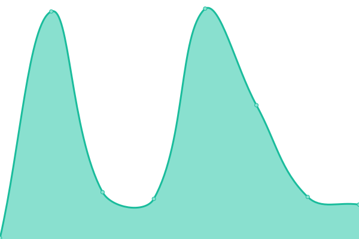

# [📈 Live Status](https://status.lbpunion.com): <!--live status--> **🟩 All systems operational**

This repository contains the open-source uptime monitor and status page for [Beacon](https://discord.gg/lbpunion), powered by [Upptime](https://github.com/upptime/upptime).

<!--start: status pages-->
<!-- This summary is generated by Upptime (https://github.com/upptime/upptime) -->
<!-- Do not edit this manually, your changes will be overwritten -->
<!-- prettier-ignore -->
| URL | Status | History | Response Time | Uptime |
| --- | ------ | ------- | ------------- | ------ |
|  [SCEE - PS4 Server](https://littlebigplanetps3.online.scee.com:10061/LITTLEBIGPLANETPS3_XML) | 🟩 Up | [scee-ps-4-server.yml](https://github.com/LBPUnion/UnionStatus/commits/HEAD/history/scee-ps-4-server.yml) | 

 520ms
     
 | 

<a href="https://status.lbpunion.com/history/scee-ps-4-server">100.00%</a>
    

|  [Beacon - Game Server](https://lighthouse.lbpunion.com/LITTLEBIGPLANETPS3_XML/status) | 🟩 Up | [beacon-game-server.yml](https://github.com/LBPUnion/UnionStatus/commits/HEAD/history/beacon-game-server.yml) | 

 186ms
     
 | 

<a href="https://status.lbpunion.com/history/beacon-game-server">85.08%</a>
    

|  [Beacon - API](https://lighthouse.lbpunion.com/api/v1/status) | 🟩 Up | [beacon-api.yml](https://github.com/LBPUnion/UnionStatus/commits/HEAD/history/beacon-api.yml) | 

 90ms
     
 | 

<a href="https://status.lbpunion.com/history/beacon-api">90.51%</a>
    

|  [Beacon - Website](https://beacon.lbpunion.com/status) | 🟩 Up | [beacon-website.yml](https://github.com/LBPUnion/UnionStatus/commits/HEAD/history/beacon-website.yml) | 

 148ms
     
 | 

<a href="https://status.lbpunion.com/history/beacon-website">90.51%</a>
    

<!--end: status pages-->

[**Visit our status website →**](https://status.lbpunion.com)

## 📄 License

- Powered by: [Upptime](https://github.com/upptime/upptime)
- Code: [MIT](./LICENSE) © [Upptime](https://upptime.js.org)
- Data in the `./history` directory: [Open Database License](https://opendatacommons.org/licenses/odbl/1-0/)
